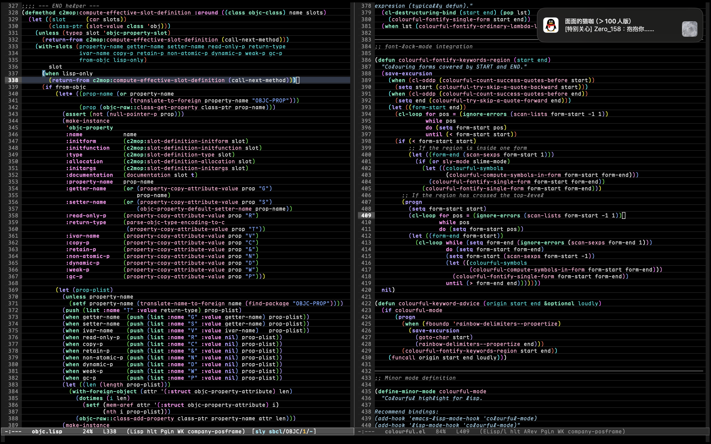

# Colourful

Emacs colourful highlight plugin for lisp.



## Usage

Load `colourful.el`, You can clone it into `.emacs.d/` and `(require 'colourful)`; Then enable `colourful` minor mode under `emacs-lisp-mode` or `lisp-mode`.

Recommend settings:

``` emacs-lisp
(add-hook 'emacs-lisp-mode-hook 'colourful-mode)
(add-hook 'lisp-mode-hook 'colourful-mode)
```

# Acknowledgements

Ported from same-named LispWorks plugin by myself.

Support Neurodivisity & Transgender & Plurality!
